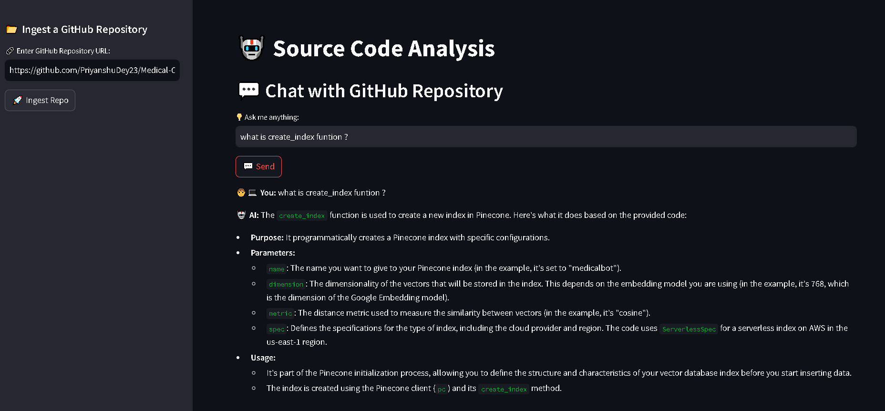

# 🚀 Source Code Analysis



## 📌 Overview
**Source Code Analysis** is a Streamlit-based application that allows users to **ingest a GitHub repository** and **chat with it** using AI. It utilizes **LangChain, ChromaDB, and Google Generative AI** to enable interactive source code analysis. It Uses the **Context-Aware Splitting** Technique which means it Tag to Python function

## 🛠 Features
- 📂 **GitHub Repository Ingestion** – Clone and process a repository.
- 🔎 **AI-Powered Code Analysis** – Ask questions about the repository.
- 💾 **Vector Database Storage** – Stores code embeddings in ChromaDB.
- 🧠 **Memory-Based Conversations** – Maintains chat history.
- 🎯 **Conversational Retrieval Chain** – Provides accurate responses using MMR-based search.

---

## 📂 Project Structure
```
📦 source-code-analysis
├── 📂 src
│   ├── helper.py  # Repository ingestion, text processing, and embeddings
├── store_index.py  # Loads repo splits text, and stores in ChromaDB
├── app.py  # Streamlit UI for interacting with the repo
├── requirements.txt  # Dependencies
└── README.md  # Project documentation
```

---

## 🚀 Installation & Setup
### 1️⃣ Clone the Repository
```sh
git clone https://github.com/PriyanshuDey23/Source-Code-Analysis-Generative-AI.git
cd source-code-analysis
```

### 2️⃣ Create a Virtual Environment
```sh
python -m venv venv
source venv/bin/activate  # On macOS/Linux
venv\Scripts\activate  # On Windows
```

### 3️⃣ Install Dependencies
```sh
pip install -r requirements.txt
```

### 4️⃣ Set Up API Keys
Create a `.env` file and add your **Google API Key**:
```sh
GOOGLE_API_KEY=your_google_api_key
```

---

## 🎯 How to Use
### 1️⃣ Run the Application
```sh
streamlit run app.py
```

### 2️⃣ Ingest a GitHub Repository
- Enter a **GitHub repository URL** in the sidebar.
- Click **"Ingest Repo"** to clone and index the repository.

### 3️⃣ Chat with the Repository
- Type a question in the chat input field.
- Click **"Send"** to receive AI-generated responses about the code.

### 4️⃣ Clear Repository
- Click **"Clear Repository"** to remove the stored repo and reset the session.

---

## ⚡ Technologies Used
- **Python** 🐍
- **Streamlit** – For UI 📺
- **LangChain** – For AI-powered retrieval 🤖
- **ChromaDB** – For vector storage 📊
- **Google Generative AI** – For embeddings & chat ✨

---


## 📝 License
This project is licensed under the **MIT License**. See [LICENSE](LICENSE) for more details.

---

